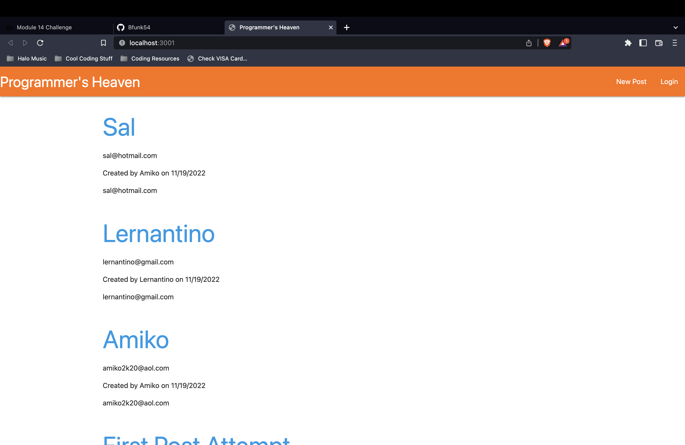
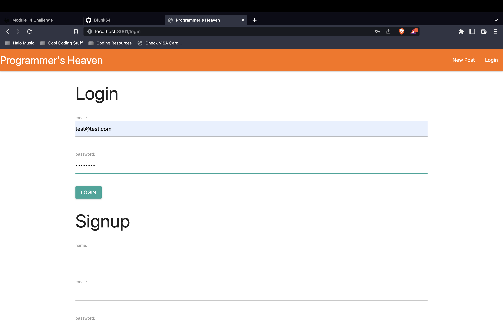
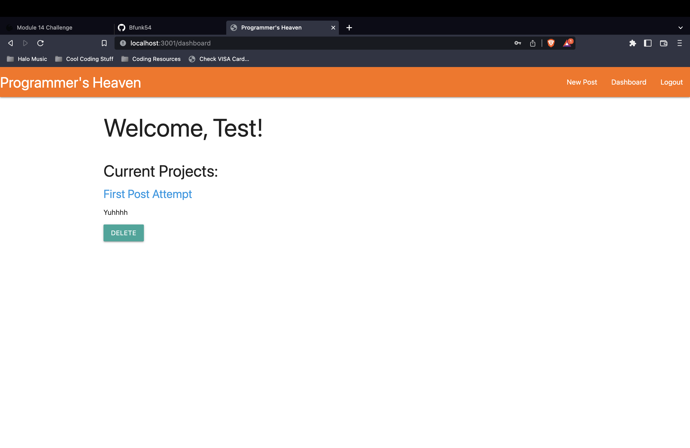
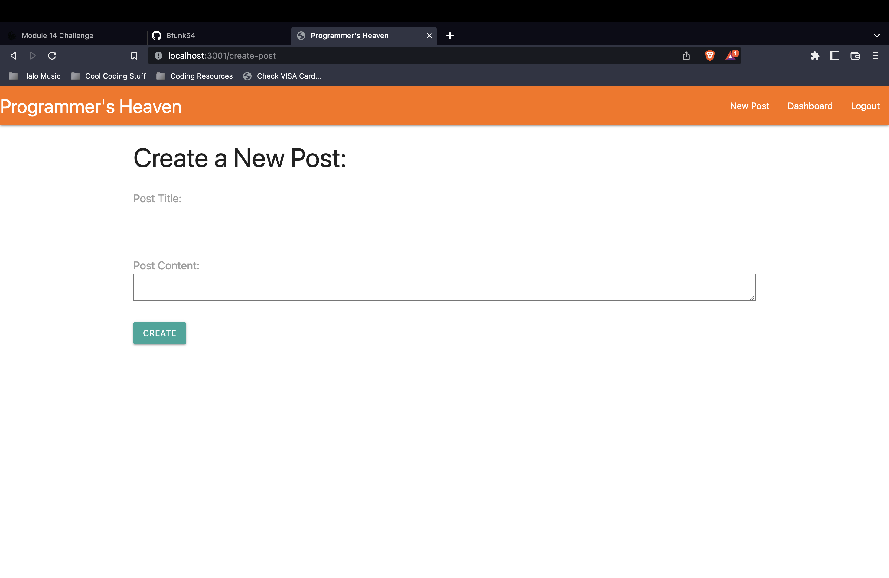

# 

# Programmer's Heaven

## Description
This is a web app that shows a great example of a forum, using a database to store login information for users, post data, comments data, and it's all routed to look good out on an html page!

## Table of Contents
1. [Installation](#installation)
#
2. [Usage](#usage)
#
3. [License](#license)
#
4. [Contribute](#contributing)
#
5. [Tests](#tests)
#
6. [Screenshots](#screenshots)
#
7. [Questions](#questions)

(<a href="#mit-license">back to top</a>)

## Installation
Open the project folder in the terminal and type in the command 'npm i'. Once that is done, type 'node index.js' or 'npm start' (it can also be started using nodemon using the command 'nodemon'). You should then be able to command click the link in the terminal or just type 'localhost:3001/' into your web browser and hit enter.

(<a href="#mit-license">back to top</a>)

## Usage
Using this project is super easy, once you are the website, you will see the hompage displaying all the posts. Clicking on any other link or button on the site will redirect you to the login/signup page. Once you are logged in, you are now able to view posts and comment on them as you please as well as create a new post. All of this information is stored in a database.

(<a href="#mit-license">back to top</a>)

## License
[MIT License](https://opensource.org/licenses/MIT)

(<a href="#mit-license">back to top</a>)

## Contributing
Bfunk54/ProgrammersHeaven

(<a href="#mit-license">back to top</a>)

## Tests
To test, clone into the repo and use a program such as DBeaver to see the database and see how all users save and how posts and comments save and delete in the database. You can also test by using the website and seeing if all functions are working correctly.

(<a href="#mit-license">back to top</a>)

## Screenshots

(<a href="mit-license">back to top</a>)

## Questions
Github: https://github.com/Bfunk54

Email me with any questions: ben_fein@icloud.com

(<a href="#mit-license">back to top</a>)

## Link to the site:
[ProgrammersHeaven](https://programmersheaven.herokuapp.com/)
[Github Repo](https://github.com/Bfunk54/ProgrammersHeaven)

(<a href="#mit-license">back to top</a>)

